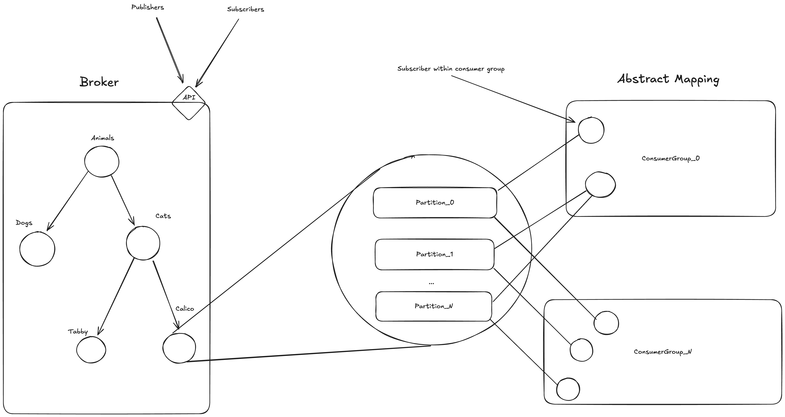

Great Value Kafka

## Description of project topic, goals, and tasks

The goal was to create a distributed message queue much like Kafka, but the type of Kafka you'd find at walmart for cheap.

Features:

- Publish/subscribe
- Concurrent request handling
- Message TTL and evictions to save space (cron job to sweep the queue)
- Consumer groups
- Ordering guarantees by partition
- Key based partitioning for custom load balancing
- Multiple topics
- Hierarchical topics
- Many publishers, many subscribers, no limit aside from hardware
- Configurable partition size, max message size, and time to live

Overall Design:

#### Limitations:

- There is support for topic trees, but it is static; the topic leaf nodes should all be setup before subscribing. If you update the leaf nodes afterwards, you will still get the new items across all hierachies but if you add a new child later you won't get that
- Not the best quality code right now, but it works. Working on improving it.

## Docs and Tests

- No dependencies!!
- Docs: `make docs`
- Tests: `go test -C ./src/greatvaluekafka -run Final`
